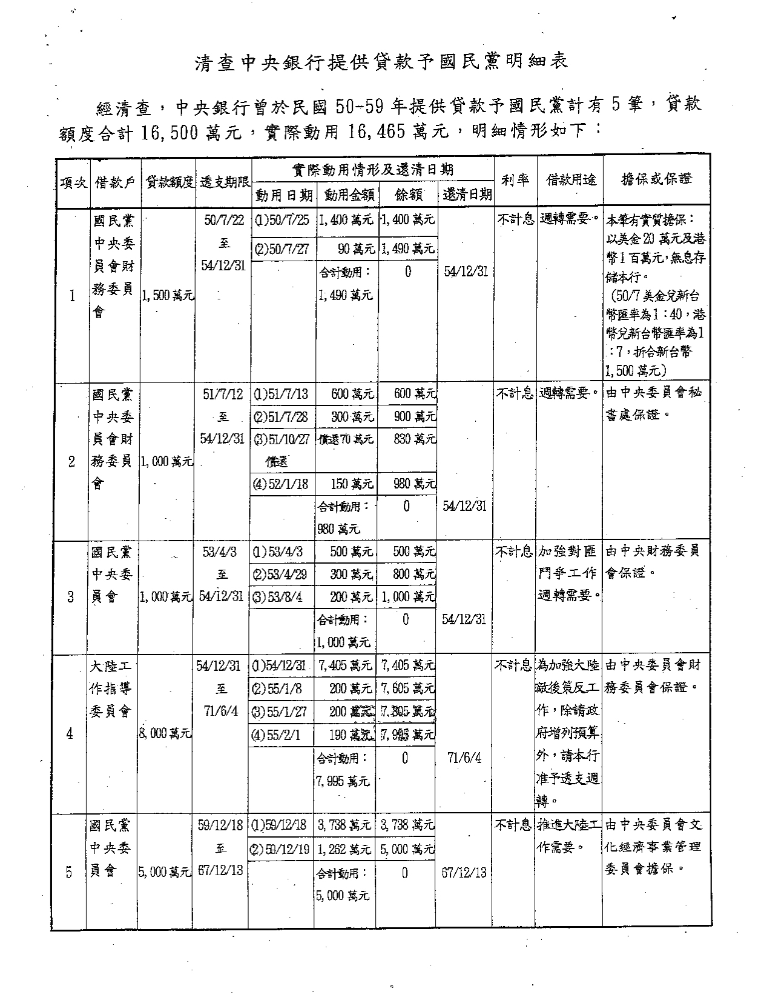
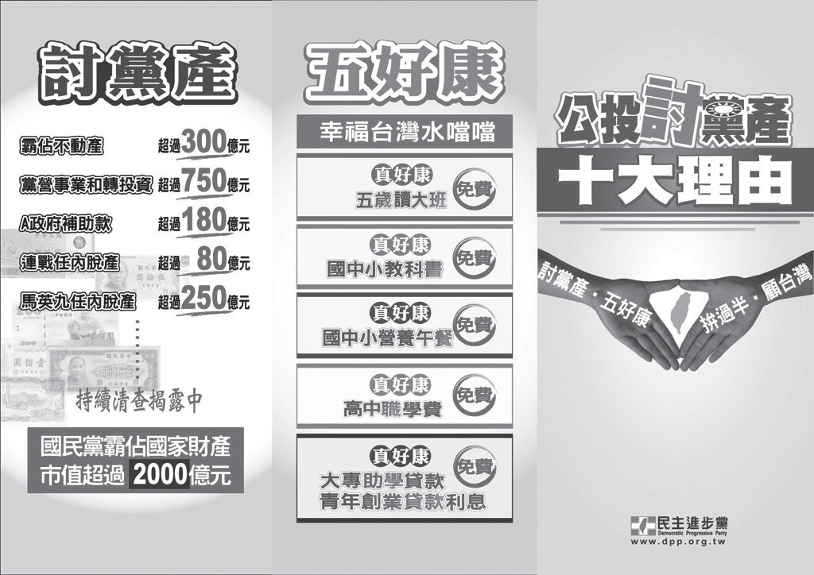
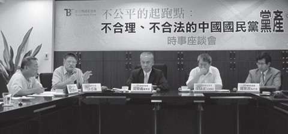

## 民進黨執政時期處理黨產問題的成敗

由於2000年陳水扁贏了總統選舉，政權和平移轉，一方面雖然開啟了21世紀台灣民主政治發展的新頁，但另一方面也讓敗選的中國國民黨披上「民主政黨」的偽裝外衣。換言之，台灣在政權移轉的過程中，黨產議題乃是轉型正義中重要的一環。但由於反對中國國民黨政權的勢力之社會支持基礎尚未穩固建立，致使中國國民黨仍掌握極大的談判籌碼，足以主導整個轉型過程。因此，台灣出現了「有轉型而無正義」的怪現象，與許多新興民主國家大不相同1。

為求落實政黨公平競爭環境，民進黨作為手握行政權寶劍的新世紀尋寶者，當然有心繼續追尋失落的國家寶藏，無奈在朝小野大、司法偏頗，中國國民黨勢力依舊盤據媒體的艱困環境下，尤其加上若干民進黨人士從狹隘的「選舉政治」觀點操作議題，使得嚴肅的黨產問題淪為藍綠對立鬥爭的漩渦。在這些因素綜合交錯下，民進黨執政期間在黨產問題處理上或許交出了令許多人不滿的成績單，但持平而論，民進黨在處理黨產問題上，有值得誇耀的功績，當然也有未竟的遺憾。

### 一、值得肯定的成就

#### 1. 查證與公開

在2000年民進黨執政前，其實有關論述中國國民黨黨產的傳聞故事早已流傳許多，相關研究成果雖然數量稀少，但。1991年9月由澄社出版的《解構黨國資本主義》與2000年1月由財訊出版的《拍賣國民黨》可謂當中兩本的重要參考著作。可惜的是，在中國國民黨長期把持中央政權下，許多事實無法獲得證實而被當成污衊執政黨的謊言。民進黨執政後，由於監察院2001年4月間對早年核准由國民黨轉帳撥用之國有特種房地、撥歸經營之19家日產戲院、接受贈與之地方所有土地及建物調查指出，過去各級政府將國家財產無償贈與中國國民黨之行為，已在人民及政黨之間形成不公平之差別待遇，顯與憲法平等精神有悖，「涉有違失」，並囑行政院應確實澈底清理、依法處理。

有論者認為，這份監察院的調查報告有以下3項貢獻，使討黨產運動取得進入制度化操作的可能性：一、為追討國民黨黨產設立基準日。其後行政院所提出的「黨產條例」與民進黨發動的討黨產公投運動，皆以2001年4月6日做為基準日，該日之後所處分的黨產，都視為脫產行為，國民黨應償還其價額。二、為行政院追討黨產建立基礎。基於現行憲法中的監察權，黃煌雄報告經監察院通過送請行政院糾正，行政院必須進行相關行為以改正過去的錯誤。三、提出以「實質法治國」原則處理黨產問題。也就是對政黨之規範，應以自由民主憲政秩序為根本價值，而不以一般國民財產權之保障及法律形式上之合法取得或移轉為依據2。

後來行政院即依據監察院調查報告作為原點，著手對政黨不當取得的國家資產進行清查及研議處理方式。行政院長蘇貞昌於2006年8月23日行政院院會第3003次會議進一步具體裁示，由國家資產經營管理委員會黨產處理專案小組（簡稱黨產處理小組）統籌，請各主辦及協辦機關由國家檔案中清查黨產相關事項，向社會大眾說明。過去有關中國國民黨及其黨營事業、附隨組織的關鍵相關資料，往往隱藏於各機關或國、公營事業機構保管之國家檔案中，外界縱傳聞已久，但始終難以一窺究竟。至於在行政機關內部，則受制於公文書保存期限等問題，有年代久遠搜集不易的困境。行政院當時藉由行政一體的指揮，責令各相關機關公務員清查檔案，閱卷影印，整理統計分析，再由黨產處理小組統籌公開資訊。實踐結果雖未能達到全面清查程度，卻也發掘許多珍貴的官方文書，可作為推翻黨產正當性的重要史料。

**圖：央行提供給行政院黨產處理小組的公文，證明無息貸款確有其事。**

持平而論，民進黨雖掌握中央行政權長達8年，但黨國威權勢力在國家體制內依附太深，導致行政院在指揮下轄各行政機關進行清查黨產過程中，面臨諸多鮮為外界所知的阻力。首先在民進黨任用的政務官階層裡，由於不少政務官欠缺處理黨產問題的意識，更時有逃避推託的情形，讓行政院陷入事倍功半的困境。其次在在高階常任文官階層裡，許多人本來就深受黨國栽培而帶有濃厚的黨國色彩，受公務員法嚴格保障身份又指揮不易。再加上許多在位文官乃至其老長官本身恐怕就是當年國庫通黨庫的實際協助者，要求其清查黨產猶如令其「自證己罪」。綜上所述，在行政院整體黨產清查過程中，內部「上令無法下達」情形時有所聞。許多上級分配的清查任務，往往要催促再三，才能推進些許成果。

以外界傳聞中央銀行曾以「無息透支」方式借給中國國民黨共5筆款項事件查證過程為例，便可體察民進黨執政的困境。在2003年12月間，民進黨立委葉宜津曾召開記者會指摘1961至1970年間中國國民黨利用特權違法向中央銀行無息借款，將央行當提款機用來投資、補國民黨經費差絀，甚至拿來輔選。當時央行官員表示，央行的帳務都是依照會計法及行政院主計處所核定的會計制度處理，對於未了債權，必須保留憑證，現有的未了債權中，並沒有借錢給中國國民黨的資料3。若仔細分析，可看出當時央行官員的回應十分詭詐，巧妙地把焦點導向至「未了債權」上，至於有關違法無息借款事實的存否，毫無著墨。後來幾經行政院追促，央行最後才以「密件」向行政院證實確曾於1961至1970年間陸續提供5筆無息貸款、給中國國民黨中央委員會、財務委員會及大陸工作指導委員會。於借款中除一筆由中國國民黨提供實質擔保外，其餘都以信用保證方式借貸。央行曾違法無息放款給中國國民黨的史實，直到民進黨政府下野前1年才終獲官方證實。

另一個類似的故事發生在行政院指揮退輔會調查昔日中國國民黨與該會合資經營天然氣事業，坐享高額獨佔利益事件。退輔會黨國不分地找中國國民黨結合地方派系大搞獨佔事業，相關故事在民間早已流傳數十年。本案也是幾經行政院催促，退輔會才於2007年4月證實「…天然氣事業係以導管輸送天然氣或石油氣供應家庭、工商用燃料為主要經營項目，為一需先期投入輸管線埋管資金，重視公共安全的公用事業；退輔會為擔負輔導榮民就業的安置任務，並配合政府能源及環保政策，促進經濟發展，經國民黨黨營事業中央投資公司、光華投資公司與退輔會，聯合各地區桶裝瓦斯等當地人士，共同經營欣隆等11家天然氣公司……」。

總的來說，民進黨執政時期對於黨產問題的重要貢獻之一，在於「查證」與「公開」。亦即一方面透過行政院由上而下的指令以及由下而上的清查結果，讓過去時被指摘為政治污衊的故事如今成為經官方背書證實的真相。另一方面行政院於2007年4月間，進一步架設專屬網站，讓取得不易的的寶貴資料公諸社會，讓全民公斷。

這一連投入心力進行的黨產查證與公開的工程，與政黨公平競爭與民主深化息息相關，具有超越藍綠意識型態性格，縱使於中國國民黨重掌執政權後亦應繼續辦理查證與公開工作。讓人遺憾的是，就在馬總統上任的前一天，亦即2008年5月19日傍晚「清查不當黨產網站」就悄悄地關閉，過去政府發布的相關行政命令或黨產資料，也馬上從國產局等政府機關的網站上移除，行徑猶如嫌犯湮滅不利證據一般。至於到底是奉誰的指令，讓行政院研考會官員膽敢移除此一重要的政府公開資訊，到今天為止仍然是一個未解的迷團。

有關民進黨2000至2007年執政期間行政院處理黨產之重要相關作為與內容，茲彙整下表，供讀者參考。

**行政院處理不當黨產大事紀**

<table>
  <thead>
    <tr>
      <th>日期</th>
      <th>項目</th>
      <th>重要內容</th>
    </tr>
  </thead>
  <tbody>
    <tr>
      <td>2001.04</td>
      <td>監察院函請行政院就各級政府機關將其所管有之公有財產，贈與、轉帳撥用或撥歸予社團法人中國國民黨所有或經營，是否涉有違失案，請行政院確實澈底清理，依法處理。</td>
      <td>
        <ol>
          <li>監察院調查內容主要包括中國國民黨轉帳撥用國有特種房屋及其基地、前台灣省行政長官公署撥歸中國國民黨經營之19家戲院、及贈與中國國民黨之公有土地及建築物三部分。</li>
          <li>行政院於2001年12月4日函復監察院，除釐清 部分事實外，並說明中國國民黨黨產取得 之三種型態，依當時之法制環境及政治背景，形式上或符合法律規定，但僅能認符合形式法治國原則，而與實質法治國原則有間，如依現行法律規定請求中國國民黨返還，基於法律安定之考量，或已罹於時效或除斥期間已經過，且可能涉及第三人已取得權益之保障，實務上有其困難。為符合實質法治國原則，以特別立法方式，妥為規範處理中國國民黨黨產，無論從政黨政治、民主法治、平等原則、財產保障、法律不溯及既往等層面探討，均無違憲之嫌，法務部已積極研擬特別法草案中。
          </li>
        </ul>
      </td>
    </tr>
    <tr>
      <td>2002.09</td>
      <td>研擬「政黨不當取得財產處理條例」（草案）</td>
      <td>法務部研擬「政黨不當取得財產處理條例」（草案），並經行政院於2002.09送立法院審議。</td>
    </tr>
    <tr>
      <td>2003.12</td>
      <td>游院長指示國家資產經營管理委員會成立專案小組，處理政黨不當取得國家資產歸還事宜</td>
      <td>「國家資產經營管理委員會」第18次委員會會議決議：日前國民黨連主席公開表示願意歸還實踐大樓及7家戲院，正足以顯示國民黨當初取得或運用這些國家資產的不正當性與不合理性。政府有責任讓這些國民黨已經確定要歸還的黨產儘速返還國庫。對於本案有以下幾點結論：
        <ol>
          <li>於國家資產經營管理委員會成立專案小組，處理政黨不當取得國家資產歸還事宜，並請財政部、經濟部、國防部、內政部、主計處等相關部會指派簡任級主管參加。</li>
          <li>請專案小組儘速擬定「政黨不當取得國家資產歸還政府處理原則」，並於一周內訪問國民黨，正式洽談歸還事宜與期程。原則上希望實踐大樓及7家戲院能夠在農曆年前完成相關返還手續。</li>
          <li>過去有許多公務人員迫於政治壓力，不得不配合國民黨不當取得或不合理使用國家資產，對於黨國不分之特殊時空與政治環境，行政院不會追究相關公務人員的行政責任。此外，請專案小組擬定專案獎勵原則（包括記功與發給獎金），對於執行政黨不當取得國家資產歸還工作有功之同仁，應給予適當之鼓勵。</li>
        </ol>
      </td>
    </tr>
    <tr>
      <td>2004.01.</td>
      <td>國家資產經營管理委員會成立黨產處理專案小組</td>
      <td>財政部成立國家資產經營管理委員會黨產處理專案小組，負責處理不當黨產事宜。</td>
    </tr>
    <tr>
      <td>2004.1至2005.11.</td>
      <td>召開6次專案小組會議</td>
      <td>
        <ol>
          <li>清查公布國民黨或其附隨組織所有原屬國家資產之財產，截至目前為止，者計土地685筆，面積147.7090公頃，按2006年公告土地現值計為243億2600萬元（未含轉帳撥用之特種房屋價值）。</li>
          <li>迄今國民黨以拋棄所有權方式辦竣國有登記之土地計57筆，面積1.8643公頃，按95年公告現值計為13億元，另有房屋6棟，面積14657.23平方公尺，課稅現值為8100餘萬元。</li>
          <li>有關將新世界、嘉義、壽星、光華、新生5家戲院不動產歸還國庫案，財政部已4次行文國民黨，請其儘速兌現該黨連前主席於2004年總統大選期間之宣示，惟因雙方就歸還計價標準意見不一，已請財政部續洽商國民黨依當期公告土地現值加四成歸還。</li>
          <li>研擬「政黨或其附隨組織取得或使用國家資產之協商處理原則」（草案），作為現階段各機關與政黨或其附隨組織協商處理之依據，並經本院2004年3月1日核定。</li>
          <li>實踐大樓及實踐堂房屋，同意對國民黨不追收歷年使用補償金，並由該黨以拋棄所有權方式登記為國有。</li>
          <li>請交通部就中廣公司接管日治時期台灣放送協會各地支部及運用政府預算購置之財產，已提起訴訟部分，繼續辦理。</li>
        </ol>
      </td>
    </tr>
    <tr>
      <td>2005.10</td>
      <td>函送「政黨不當取得財產處理條例」草案</td>
      <td>
        <ol>
          <li>政黨不當取得財產處理條例」草案送請立法院審議。</li>
          <li>前經在野黨26次杯葛，迄2006.10始付委，目前在委員會審查中。</li>
        </ol>
      </td>
    </tr>
    <tr>
      <td>2006.01</td>
      <td>陳總統元旦致詞</td>
      <td>未來在兩年多的任期內，將進一步深化包括：金融改革、稅制改革、18％優惠存款利率改革、媒體改革、不當黨產的追討及憲政改造等六大改革。</td>
    </tr>
    <tr>
      <td>2006.01.</td>
      <td>謝院長第2973次院會裁示</td>
      <td>國民黨陸續處分黨產，對許多人感情造成傷害，如果是不當黨產，政府何以未能有效阻止？請財政部專案小組持續清查該類黨產取得及現況，並請許政務委員志雄邀集相關部會，研究法律上採取適當程序或措施之可能性。</td>
    </tr>
    <tr>
      <td>2006.01.</td>
      <td>行政院許政務委員雄邀集相關部會研商「追討政黨不當取得財產相關問題」（第1次）會議</td>
      <td>
        <ol>
          <li>儘速協調立法院加速推動，早日完成「政黨不當取得財產處理條例」立法程序。</li>
          <li>請內政部積極研議適當作法，防止國民黨變賣脫產，並從土地使用管制層面從嚴限制使用，使其不具市場性。</li>
          <li>為使社會民眾知悉國民黨以不當方式取得國家資產，新聞局應結合社會民間力量，廣為宣傳。</li>
          <li>請金管會了解榮麗公司耗資90餘億購買三中，資金來源是否有國內借款，及交易過程是否涉及不法。</li>
        </ol>
      </td>
    </tr>
    <tr>
      <td>2006.07.</td>
      <td>行政院許政務委員雄邀集相關部會研商研「追討政黨不當取得財產相關問題」（第2次）會議</td>
      <td>
        <ol>
          <li>中廣公司接管日治時期台灣放送協會各地支部及運用政府預算購置之財產，請交通部持續訴追。</li>
          <li>國民黨經營之日產戲院有19家，既係取自國家，應按原物返還；如已移轉第三人或被徵收，無法歸還，應以當期土地公告現值加四成之金額，歸還國庫。至於國民黨只願意將新世界等5家戲院房地，以3億4491萬9428元「捐贈」國庫，應不予同意。</li>
          <li>中廣公司所有坐落彰化縣芬園鄉同安寮段號房地，涉及交通部「天馬計畫」及國防部「中興計畫」，請財政部邀集相關部會清查，確實訴追。</li>
          <li>有關黨營事業，請經濟部持續清查中央投資公司及光華投資公司之現有資產、資金來源及股權結構等資料。</li>
          <li>請財政部針對內政部提供黨營事業機構土地總歸戶資料，逐一清查國民黨轉投資事業機構所有之不動產。</li>
        </ol>
      </td>
    </tr>
    <tr>
      <td>2006.07</td>
      <td>行政院許政務委員雄邀集相關部會研商「國民黨處理中影公司黨產相關事宜」（第１次）會議</td>
      <td>
        <ol>
          <li>中影公司召開臨時董事會通過修正中影公司取得或處分資產處理程序、公司章程及收回優先股300萬股等情形，已嚴重影響合庫及臺銀公股股東權益，請合庫及臺銀儘速提起民事訴訟，並將起訴狀送請經濟部商業司參考。</li>
          <li>請經濟部商業司依臺銀及合庫起訴所引之相關過程事實，本於職權調查證據，倘中影公司有違反公司法相關規定，應不予同意變更登記；並將審查結果通知地政機關。</li>
          <li>研議中影公司變更章程，是否涉及背信疑義；並請臺銀及合庫洽律師研議聲請假扣押、假處分等保全程序之可行性。</li>
        </ol>
      </td>
    </tr>
    <tr>
      <td>2006.08</td>
      <td>蘇院長第3003次院會裁示</td>
      <td>國民黨黨產是台灣民主轉型正義能否實現的嚴肅課題，基於為人民保護國家財產之責任，請各主管機關由國家檔案中清查下列事項，並由財政部黨產處理專案小組統籌，向社會大眾提出說明。
        <ol>
          <li>國民黨及其黨營事業、附隨組織，歷年來究意取得政府各級機關多少補助？</li>
          <li>中國國民黨及其黨營事業、附隨組織曾擁有或仍然擁有的資產，有多少是由政府、各級政府或國營事業所轉讓得來的？方式為何？總價值是多少？</li>
          <li>中國國民黨及其黨營事業、附隨組織在特權經營環境中賺了多少？</li>
          <li>中國國民黨及其黨營事業、附隨組織過去向政府申請減免稅捐，歷年來總共少繳多少稅捐？</li>
          <li>由於中國國民黨的黨工人員的黨職年資併入公職年資計算，歷年來國庫究竟幫中國國民黨付了多少退休金或資遣費？</li>
          <li>歷年來中國國民黨黨產究竟用到那裡去？還有多少金額使用於競選經費及政治活動經費？</li>
        </ol>
      </td>
    </tr>
    <tr>
      <td>2006.10</td>
      <td>行政院許政務委員雄邀集相關部會研商研「追討政黨不當取得財產相關問題」（第3次）會議</td>
      <td>
        <ol>
          <li>請各主辦機關邀集協辦機關即刻開始清查作業，必要時可邀請專家學者進行委託研究，並於2007年3月底前完成調查報告。</li>
          <li>為使社會大眾了解事實真相，研考會應於2007年1月前完成建置政府清查國民黨黨產與黨營事業資料之專屬網站，另立即成立顧問委員會，規劃對外說明及展覽事宜，預計於2007年7月舉行，同步舉辦「轉型正義」國際研討會。
          </li>
        </ol>
      </td>
    </tr>
    <tr>
      <td>2006.11</td>
      <td>行政院許政務委員雄邀集相關部會研商「國民黨處理中影公司黨產相關事宜」（第2次）會議</td>
      <td>
        <ol>
          <li>有關禁止中影公司董、監事行使職權之假處分，雖遭法院駁回，台灣銀行仍應持續辦理抗告事宜，並積極研議中影公司有無涉及背信疑義；本爭議事件未定案前，不宜處分所持有之中影公司股份。</li>
          <li>新聞局接獲中影公司召開臨時董事會通過修正中影公司取得或處分資產處理程序、公司章程及收回優先股300萬股，嚴重影響臺銀及合庫公股股東權益等資料後，即會商有關機關，倘有違反公司法、電影法等相關規定，應撤銷原已許可之行政處分，不予同意變更登記。</li>
          <li>中影公司申請增資、減資等資本額變更登記，倘違反相關法令、有損及公股權益等情事時，經濟部應為不予變更登記之處分。</li>
        </ol>
      </td>
    </tr>
    <tr>
      <td>2006.12</td>
      <td>行政院許政務委員雄邀集相關部會研商研「追討政黨不當取得財產相關問題」（第4次）會議</td>
      <td>
        <ol>
          <li>各機關確實加強辦理清查作業，務必於2007年3月底前完成。</li>
          <li>清查救國團使用各地青年活動中心、山莊與學苑之不動產取得來源及其法律關係，並就出租之國有房地是否調高租金，研議一致性之做法，俾與救國團協商返還教育部補助款。</li>
          <li>中廣公司所有座落彰化縣芬園鄉同安寮段房地，屬「天馬計畫」由交通部編列預算購得之3分之1產權，業經訴訟判決政府勝訴；其餘持分3分之2所有權，亦應屬政府出資購買之財產，仍請相關機關清查有無政府出資之相關資料，以利追討。</li>
        </ol>
      </td>
    </tr>
    <tr>
      <td>2007.01</td>
      <td>陳總統元旦祝詞</td>
      <td>絕大多數國人同胞不能接受的「不當黨產」等重大轉型正義問題，仍然未得到妥適的處理。</td>
    </tr>
    <tr>
      <td>2007.01</td>
      <td>行政院政務委員許志雄邀集相關部會研商研「追討政黨不當取得財產相關問題」（第5次）會議</td>
      <td>
        <ol>
          <li>有關救國團委辦補助及各項清查作業請各機關於2007年2月底初步完成各項清查作業。</li>
          <li>國民黨出售三中（中視、中廣、中影）問題，請新聞局就媒體報導國民黨將華夏投資公司股權全部讓予榮麗公司，中影公司部分及業務未移撥NCC前，有關中廣、中視無線電波頻率分配及股權移轉處理有無違反相關廣電法令等情，於2007.1.31第3026次院會提出專案報告。</li>
          <li>請研考會於2007.2.中旬完成網站建置，並規劃網站啟用儀式與行銷方式，另規劃黨產展覽事，並擇期向 院長提出簡報。</li>
          <li>有關黨產與轉型正義研討會，請外交部協助洽邀德國、匈牙利、捷克等有處理黨產經驗之專家、學者。</li>
        </ol>
      </td>
    </tr>
    <tr>
      <td>2007.01</td>
      <td>蘇院長第3026次院會就新聞局所提「有關中央電影事業股份有限公司（中影）股權移轉案」報告案提示</td>
      <td>
        <ol>
          <li>國民黨掌握黨政軍特權，藉著執政之便，國庫通黨庫，把原來屬於台灣人民、屬於國家的財產，納為黨產，變成不義之財，現在公然著出售股權意圖中飽私囊！請許政務委員督導，新聞局協調、研議，請財政部國庫署指導公股代表行使查帳權，國有財產局協助清查中影接收之日治時代戲院，應追討部分，經濟部商業司對中影申請變更章程案之審核應注意股東權益及全民利益，並請法務部留意本案相關人士有無涉及不法。</li>
          <li>政黨輪替後，執政黨有責任也要有擔當，在轉型的過程中要堅持正義，追回全民應有的權益，不容國民黨假借各種手法占取國家的資源。例如電波頻率是屬於國家（即全民）所有，不應藉著股權移轉變成私人所有，通傳會對於股權異動既有許可權，應堅守法律規定，絕不許有心人士藉著股權的移轉，將國家資源轉為私人或特定政黨所有。中廣公司在2004年換發執照時，已承諾在2006年5月前繳回寶島網及音樂網的頻率，現已逾期甚久，請林政務委員逢慶督促通傳會本於權責，及維護國家全民利益的立場，剋日執行貫徹，否則應追究相關責任。</li>
        </ol>
      </td>
    </tr>
    <tr>
      <td>2007.03</td>
      <td>行政院政務委員許志雄邀集相關部會研商研「追討政黨不當取得財產相關問題」（第6次）會議</td>
      <td>
        <ol>
          <li>在特權營利方面，請經濟部清查國民黨具代表性之黨營事業（如中央投資公司等），追溯至1991年之營利事業收入資料；另為釐清各事業特權環境情形，補充敘明各黨營事業成立背景或當時政府政策。</li>
          <li>請內政部全面清查中華救助總會（原中國大陸災胞救濟總會）歷年來接受政府金錢補助，或使用公有土地經營相關事業（如台北市忠孝東路兒童福利中心及職業訓練中心、台北縣汐止鎮翠柏新村等）情形。</li>
          <li>有關榮麗投資公司收購三中一案，據悉似無支付價款情形，有無涉及不法，請法務部本於職權促請查察。</li>
          <li>主計處所彙整各級機關補助國民黨及其黨營事業、附隨組織之金額，尚涉幣值換算問題，請主計處參酌各年度物價指數、通貨膨脹指數等予以註明；各機關於清查時亦請一併注意。</li>
          <li>研考會提報建置政府清查國民黨黨產之專屬網站，及籌辦黨產展覽事宜情形。</li>
        </ol>
      </td>
    </tr>
  </tbody>
</table>

##### 2. 立法解決的努力

民進黨執政期間在法制上處理黨產問題的努力，其具體結晶便是「政黨法」與「政黨不當取得財產處理條例」草案的提出。詳言之，此兩者是互相配套之立法。現代民主政治係以政黨政治之方式呈現，各政黨之自由、正當發展必須給予保護。行政院當時為建立長遠政治秩序、規劃設計符合民主憲政宏規之政黨法制，於是推動制定「政黨法」，希望藉由對政黨合理管制，建構政黨內部民主機制與健全財務制度，確立政黨公平競爭之環境，使政黨能充分發揮其民主功能。

當時行政院體認到要建立健全與公平的政黨競爭環境，必須誠實面對歷史：有鑑於台灣係由威權體制轉型至民主制度，威權體制所留下的歷史問題，需要認真面對與妥善處理。例如，「政黨法」草案雖已規定政黨不得投資或經營事業，對所有政黨一律適用。但是若有特定政黨在過去的政治環境中，已經擁有龐大的黨產與黨營事業，倘若不能妥當處理，就難以實現政黨政治公平競爭之立足點平等，也可能影響到人民權益，從而削弱台灣建立的民主制度。因此行政院認為有必要制定 「政黨不當取得財產處理條例」，來面對與解決歷史問題，使台灣的民主轉型能夠真正完成。由此可見，制定「政黨不當取得財產處理條例」以處理黨產問題，是為了實現「政黨法」理想所必要的基礎工作，形式上亦可將黨產條例納入政黨法一併規範，但由於兩者功能有別，不可混為一談，不適於合併立法。總之，當時行政院清楚指出，「政黨不當取得財產處理條例」是為了解決威權體制所遺留的問題，是一種階段性任務，為政黨法之落實掃除障礙、奠定基礎，性質上屬於「限時法」、「特別法」。而「政黨法」則是希望建立未來長遠的政黨法制，適用所有政黨，性質上是一種「平時法」、「普通法」。「政黨不當取得財產處理條例」著眼於解決歷史問題，為政黨公平競爭環境奠定現實基礎；「政黨法」則著眼於確立政黨公平競爭環境之內涵，兩者各有其功能，缺一不可。

一旦政黨法與政黨不當取得財產處理條例立法通過，中國國民黨的龐大金脈將就此瓦解。因此在國會裡，中國國民黨籍立委將上開草案視為「絕對封殺」對象，尤其是追討黨產關鍵的黨產條例，自2002年9月行政院提出後即遭長期擱置在程序委員會，擱置次數超過百次以上，可見中國國民黨強力捍衛黨產的決心。截自2007年1月止，國會審議情形詳如下表所整理。若以成敗論英雄，沒有國會多數支持的民進黨政府當然是失敗者。但若從法制基礎工作奠基而論，中國國民黨的強力封殺護衛反而意味著相關立法的確能點中死穴。倘若2012年一旦政治局勢發生改變，新政府有決心澈底解決黨產問題的話，所有基礎法制工作早已完竣齊備，可在此基礎上立即展開立法追討，當年行政院的努力看似白費功夫，實則仍值肯定。

**政黨不當取得財產處理條例草案立法院審議情形**

<table>
  <thead>
    <tr>
      <th>時間</th>
      <th>立法院審議情形</th>
    </tr>
    <tr>
      <th colspan="2">第5屆</th>
    </tr>
  </thead>
  <tbody>
    <tr>
      <td>2002.9.13</td>
      <td>行政院「政黨不當取得財產處理條例」草案函請立法院審議。</td>
    </tr>
    <tr>
      <td>2002.10.7</td>
      <td>協商國債付息，國民黨要求行政院將「政黨不當取得財產處理條例」撤回。（民進黨、台聯不簽字）【背景說明：因2002年度中央政府總預算遭國民黨大幅刪減歲入，造成收支無法平衡，行政院必須調整債務付息以為因應，否則將造成國庫跳票。在協商國債利息支出時，國民黨先提出要求行政院撤案、再要求黨團同意暫緩編列議程以為要脅】</td>
    </tr>
    <tr>
      <td>2002.10.8</td>
      <td>協商國債付息案，國民黨要求暫緩編列議程，否則不同意簽署國債付息的朝野協商，故而協商結論做成：協商後再行編列議程。</td>
    </tr>
    <tr>
      <td>2004.1.9</td>
      <td>民進黨提出編更議程，將「政黨不當取得財產處理條例」由程序委員會抽出逕付二讀，王院長以不符職權行使法第8條第2項規定，裁示不予處理。（經表決失利）</td>
    </tr>
    <tr>
      <td>2004.4月起迄2004.12月</td>
      <td>民進黨黨團於程序委員會提出列入院會議程報告事項屢遭國民黨封殺，未能列案。統計第5屆自行政院提案召開程序委員會次數約擱置75次。2004.12親民黨表示可支持黨產處理條例，但不應以不當黨產為法案名稱，故黨團在2004.12.21修正提案名稱為「政黨及其附隨組織取得財產清查及處理條例草案」。</td>
    </tr>
    <tr>
      <td>2004.12.31</td>
      <td>第5屆第6會期第13次會民進黨團擬具之「政黨及其附隨組織取得財產清查及處理條例草案」、親民黨團擬具之「政黨財產調查暨處置條例草案」、台聯黨團擬具之「人民團體不當取得財產處理條例」列入院會報告事項。但國民黨團隨即在2005.1.2提出復議。</td>
    </tr>
  </tbody>
  <thead>
    <tr>
      <th colspan="2">第6屆</th>
    </tr>
  </thead>
  <tbody>
    <tr>
      <td>2005.04.18</td>
      <td>民進黨黨團提出「政黨及其附隨組織取得財產清查及處理條例草案」</td>
    </tr>
    <tr>
      <td>2005.10.17</td>
      <td>行政院函送立法院審議「政黨不當取得財產處理條例草案」。</td>
    </tr>
    <tr>
      <td>2005.12.20</td>
      <td>第二會期程序委員會排入第16次會院會報告事項及討論事項，行政院版及黨團版終於列入院會議程報告事項。</td>
    </tr>
    <tr>
      <td>2005.12.23</td>
      <td>立法院第6屆第2會期第16次會，是日會議在宣讀完議事錄後，國民黨隨即提出散會動議。所有議程報告事項均未處理。</td>
    </tr>
    <tr>
      <td>2006.10.17</td>
      <td>迄第6屆第4會期黨團提案之「政黨及其附隨組織取得財產清查及處理條例草案」遭擱置32次，行政院版之「政黨不當取得財產處理條例草案」遭擱置26次。</td>
    </tr>
    <tr>
      <td>2006.10.24</td>
      <td>程序委員會表決通過將黨團擬具之「政黨及其附隨組織取得財產清查及處理條例草案」及行政院版之「政黨不當取得財產處理條例草案」列入第6屆第4會期第5次會院會報告事項。</td>
    </tr>
    <tr>
      <td>2006.10.27</td>
      <td>第6屆第4會期第5次會議程報告事項第17案及第18案民進黨黨版及行政院版之黨產處理條例。民進黨團提案逕付二讀，經表決贊成98、反對112，未能逕付二讀。國親黨團提案將本案交付內政、司法、財政及法制委員會審查。</td>
    </tr>
    <tr>
      <td>2006.11.20</td>
      <td>內政委員會召集委員高建智將黨產條例排入委員會審查，國民黨先以拒絕簽到杯葛，民進黨強力動員成會後更立即提出散會動議要求表決，主席只好宣布休息協商，但國民黨始終不同意撤回其散會動議，導致委員會終日空轉，本案未能進入實質審議。</td>
    </tr>
    <tr>
      <td>2006.12.14</td>
      <td>內政委員會召集委員高建智再度將黨產條例排入委員會審查，會議開始經數位委員程序發言，國民黨籍立委費鴻泰即提出散會動議，民進黨籍葉宜津委員提出本案應進行至審完為止，並要求點名表決；後因協商不成，委員會空轉，本案尚未能進入提案說明及大體詢答。</td>
    </tr>
    <tr>
      <td>2005.04.18</td>
      <td>民進黨黨團提出「政黨及其附隨組織取得財產清查及處理條例草案」</td>
    </tr>
    <tr>
      <td>2005.10.17</td>
      <td>行政院函送立法院審議「政黨不當取得財產處理條例草案」。</td>
    </tr>
    <tr>
      <td>2005.12.20</td>
      <td>第2會期程序委員會排入第16次會院會報告事項及討論事項，行政院版及黨團版終於列入院會議程報告事項。</td>
    </tr>
    <tr>
      <td>2005.12.23</td>
      <td>立法院第6屆第2會期第16次會，是日會議在宣讀完議事錄後，國民黨隨即提出散會動議。所有議程報告事項均未處理。</td>
    </tr>
    <tr>
      <td>2006.10.17</td>
      <td>迄第6屆第4會期黨團提案之「政黨及其附隨組織取得財產清查及處理條例草案」遭擱置32次，行政院版之「政黨不當取得財產處理條例草案」遭擱置26次。</td>
    </tr>
    <tr>
      <td>2006.10.24</td>
      <td>程序委員會表決通過將黨團擬具之「政黨及其附隨組織取得財產清查及處理條例草案」及行政院版之「政黨不當取得財產處理條例草案」列入第6屆第4會期第5次會院會報告事項。</td>
    </tr>
    <tr>
      <td>2006.10.27</td>
      <td>第6屆第4會期第5次會議程報告事項第17案及第18案民進黨黨版及行政院版之黨產處理條例。民進黨團提案逕付二讀，經表決贊成98、反對112，未能逕付二讀。國親黨團提案將本案交付內政、司法、財政及法制委員會審查。</td>
    </tr>
    <tr>
      <td>2006.11.20</td>
      <td>內政委員會召集委員高建智將黨產條例排入委員會審查，國民黨先以拒絕簽到杯葛，民進黨強力動員成會後更立即提出散會動議要求表決，主席只好宣布休息協商，但國民黨始終不同意撤回其散會動議，導致委員會終日空轉，本案未能進入實質審議。</td>
    </tr>
    <tr>
      <td>2006.12.14</td>
      <td>內政委員會召集委員高建智再度將黨產條例排入委員會審查，會議開始經數位委員程序發言，國民黨籍立委費鴻泰即提出散會動議，民進黨籍葉宜津委員提出本案應進行至審完為止，並要求點名表決；後因協商不成，委員會空轉，本案尚未能進入提案說明及大體詢答。</td>
    </tr>
    <tr>
      <td>2006.10.24</td>
      <td>程序委員會表決通過將黨團擬具之「政黨及其附隨組織取得財產清查及處理條例草案」及行政院版之「政黨不當取得財產處理條例草案」列入第6屆第4會期第5次會院會報告事項。</td>
    </tr>
    <tr>
      <td>2006.10.27</td>
      <td>第6屆第4會期第5次會議程報告事項第17案及第18案民進黨黨版及行政院版之黨產處理條例。民進黨團提案逕付二讀，經表決贊成98、反對112，未能逕付二讀。國親黨團提案將本案交付內政、司法、財政及法制委員會審查。</td>
    </tr>
    <tr>
      <td>2006.11.20</td>
      <td>內政委員會召集委員高建智將黨產條例排入委員會審查，國民黨先以拒絕簽到杯葛，民進黨強力動員成會後更立即提出散會動議要求表決，主席只好宣布休息協商，但國民黨始終不同意撤回其散會動議，導致委員會終日空轉，本案未能進入實質審議。</td>
    </tr>
    <tr>
      <td>2006.12.14</td>
      <td>內政委員會召集委員高建智再度將黨產條例排入委員會審查，會議開始經數位委員程序發言，國民黨籍立委費鴻泰即提出散會動議，民進黨籍葉宜津委員提出本案應進行至審完為止，並要求點名表決；後因協商不成，委員會空轉，本案尚未能進入提案說明及大體詢答。</td>
    </tr>
    <tr>
      <td>2006.10.24</td>
      <td>程序委員會表決通過將黨團擬具之「政黨及其附隨組織取得財產清查及處理條例草案」及行政院版之「政黨不當取得財產處理條例草案」列入第6屆第4會期第5次會院會報告事項。</td>
    </tr>
    <tr>
      <td>2006.10.27</td>
      <td>第6屆第4會期第5次會議程報告事項第17案及第18案民進黨黨版及行政院版之黨產處理條例。民進黨團提案逕付二讀，經表決贊成98、反對112，未能逕付二讀。國親黨團提案將本案交付內政、司法、財政及法制委員會審查。</td>
    </tr>
    <tr>
      <td>2006.11.20</td>
      <td>內政委員會召集委員高建智將黨產條例排入委員會審查，國民黨先以拒絕簽到杯葛，民進黨強力動員成會後更立即提出散會動議要求表決，主席只好宣布休息協商，但國民黨始終不同意撤回其散會動議，導致委員會終日空轉，本案未能進入實質審議。</td>
    </tr>
    <tr>
      <td>2006.12.14</td>
      <td>內政委員會召集委員高建智再度將黨產條例排入委員會審查，會議開始經數位委員程序發言，國民黨籍立委費鴻泰即提出散會動議，民進黨籍葉宜津委員提出本案應進行至審完為止，並要求點名表決；後因協商不成，委員會空轉，本案尚未能進入提案說明及大體詢答。</td>
    </tr>
    <tr>
      <td>2006.10.24</td>
      <td>程序委員會表決通過將黨團擬具之「政黨及其附隨組織取得財產清查及處理條例草案」及行政院版之「政黨不當取得財產處理條例草案」列入第六屆第四會期第5次會院會報告事項。</td>
    </tr>
    <tr>
      <td>2006.10.27</td>
      <td>第6屆第4會期第5次會議程報告事項第17案及第18案民進黨黨版及行政院版之黨產處理條例。民進黨團提案逕付二讀，經表決贊成98、反對112，未能逕付二讀。國親黨團提案將本案交付內政、司法、財政及法制委員會審查。</td>
    </tr>
  </tbody>
</table>

##### 3. 訴訟的追討

承前所述，行政院早於2002年9月將「政黨不當取得財產處理條例」草案函送立法院審議，惟因中國國民黨杯葛，使得該草案動彈不得，追討黨產受阻。為展現追討不當黨產決心，交通部開始於2004年起起對黨營事業中廣公司名下不黨黨產，循司法途徑訴請法院裁判塗銷其所有權。經過歷經纏訟多年，迄今有彰化芬園機室及台北板橋機室2案獲得重大成果，證明當年行政院追討黨產在法律上有憑有據：

###### （1）彰化芬園機室案

彰化芬園機室之房地標的為彰化縣芬園鄉同安寮段3筆土地之三分之一產權，面積1031.4平方公尺，以及彰化縣芬園鄉大彰路某建物三分之一產權，面積18坪。因其購置經費，係由交通部編列之「天馬計畫」專案工程預算支應，產權應屬國有，卻登記在中廣公司名下，中廣公司辯稱用地係出資購得，但一、二、三審法院均不採中廣的說法，而由天馬計畫財產目錄清冊等資料，認定本案房地是由交通部編列天馬計畫算購買興建，屬國有財產，且三分之一信託給中廣，判決中廣應在交通部2004年終止信託關係後返還，於2007年5月交通部勝訴定讞。成為民進黨執政時期討黨產訴訟的首勝，彌足珍貴。

###### （2）台北板橋機室案

台北板橋機室土地包括新北市板橋區民族段8筆土地，面積計1萬7857平方公尺。民進黨執政時期交通部提訴指出，這些土地從日據時代就登記所有權人是國庫；中華民國政府其後代表國家接收日產，應為國有土地。中廣公司則辯稱，相關土地係中廣公司接管日治時期台灣放送協會各地支部之財產，行政院於1985年3月核准「作價轉帳」予中廣公司，1985年4月完成所有權移轉登記，因此產權，早已屬於中廣所有。本案一、二審都判決中廣勝訴。不過2008年2月高院更一審合議庭認為認為「土地囑託登記」並不等同於「移轉所有權登記」，認定政府並無移轉土地所有權意思，土地管理機關變更所有權人屬違法變更而無效；況且中廣公司與政府間並無移轉物權契約，因此相關土地所有權人並未移轉，此逆轉勝訴讓交通部扳回一成。有趣的是，本案經中廣公司上訴後，最高法院於2009年9月又廢棄高院的更一審判決，主張中廣公司辯稱土地應付價金係由其為政府處理廣播事務所獲補助費中扣抵一節非全不足採，指摘高院更一審判決有速斷之嫌，又將本案打回高院繼續審理。

本案纏訟已逾6年未果，交通部從接連的一、二審連續敗訴到最高法院與高等法院更一審的逆轉，已頗具戲劇性，讓關心黨產議題人士對司法重燃信心。豈料2008年5月馬政府上台後，有利於交通部的更一審判決很恰巧地被推翻發回更審，讓人充滿無限想像空間。或許對於政治正確的司法高層來說，一旦交通部勝訴定讞，不啻造成馬英九總統向馬英九主席追討黨產的尷尬場景。

中廣公司彰化芬園機室案與板橋機室案所涉及訴訟標的價格不斐，尤其是板橋土地，由於近年地價快速飆漲，總市值達到約200億元左右。雖然在鉅額龐大的黨產清單裡，這些金額根本微不足道。縱令交通部兩案皆捷，亦無關宏旨。然而筆者認為，這兩件訴訟案的意義不僅止於追討國產而已，更重要的一點在於，中國國民黨一向以「合法取得」為黨產正當作辯護，倘若2004年沒有交通部勇於代表國家以原告立場積極以訴訟方式主張權利進而獲得若干勝訴判決，則所謂黨產「合法取得」的謊言將繼續混淆視聽，至於這些被侵佔的國家財產，也將持續掌握在政黨暨其隨附組織手中，接著變現獲利。換言之，這裡可以讓我們認清，只要讓中國國民黨持續執政，就不可能發生中國國民黨籍總統向中國國民黨主席主動追討黨產的景象。

行政院不當黨產網站於2007年底間曾公布由交通部彙整的中廣土地訴訟結果清單，其中內容因該網站遭到關閉而停止更新，但仍具有回顧參考的價值，茲一併彙整如后。

<table>
  <thead>
    <tr>
      <th>序號</th>
      <th>案名</th>
      <th>結果</th>
    </tr>
  </thead>
  <tbody>
    <tr>
      <td>１</td>
      <td>中廣板橋機室案</td>
      <td>2007年3月29日最高法院判決，高院判決交通部敗訴違背法令，應予廢棄發回更審。台北縣板橋市民族段570-1、658、658-3、658-4、752、752-2、752-3、752-4地號等8筆，面積計17857平方公尺。這8筆土地公告現值10億5千多萬元，依市值計算更高達12億。</td>
    </tr>
    <tr>
      <td>２</td>
      <td>中廣天馬計劃案</td>
      <td>最高法院於2007年5月17日宣判中廣公司上訴駁回，為交通部勝訴，這是政府向中廣索討土地獲得勝訴確定的首例。本案土地（彰化縣芬園鄉同安寮段640、640-2、640-3地號3筆土地）</td>
    </tr>
    <tr>
      <td>３</td>
      <td>中廣八里機室案</td>
      <td>一審判決中華民國所有權存在，惟塗銷中廣公司所有權登記部分則遭駁回，交通部於2006年6月16日提起上訴，經台灣高等法院於2007年3月27日宣判上訴駁回，維持一審內容，交通部正研究是否上訴中。台北縣八里鄉小八里坌段十三行小段240-2地號等16筆土地，面積26220平方公尺，約2.65甲，依2004年公告地價約值1億9千萬元，公告現值約7億5千萬元。</td>
    </tr>
    <tr>
      <td>４</td>
      <td>中廣花蓮機室案</td>
      <td>為維護國有財產權益經交通部及電信總局於2006年5月4日共同委請律師提起訴訟，花蓮地方法院預定於2007年5月1日第1次開庭。花蓮市民勤段1367、1367-1、1367-2地號等3筆土地，面積計9657平方公尺。</td>
    </tr>
    <tr>
      <td>５</td>
      <td>中廣嘉義民雄案</td>
      <td>交通部已於2005年5月敗訴三審定讞。嘉義縣民雄鄉頂寮段中廣小段607地號、同段頂寮小段369地號等2筆土地，面積計107230平方公尺。</td>
    </tr>
  </tbody>
</table>

##### 4.被告完勝的誹謗訴訟

在民進黨政府以訴訟主動追討黨產的過程裡，發生了一段始料未及的插曲，就是中國國民黨企圖主動利用訴訟方式，對參與追討黨產的政務官乃至於民間團體提告反制，卻落得灰頭土臉的故事。

話說前行政院長游錫堃自2004年10月起，曾於立法院和行政院前後三次指出，黨產信託、出售黨產都是在掏空黨產，且不法所得黨產是贓物云云，中國國民黨認為其誹謗名譽而提起自訴。其後臺北地方法院2007年6月間作出一審判決，指出中國國民黨黨產之取得，有行政院及各級政府機關將所管有之公有財產贈與、轉帳撥用、或撥歸中國國民黨所有、經營情形，顯不合現代民主法治、政黨政治理念，早有爭議，除行政院所提「政黨不當取得財產處理條例」草案外，並有監察院2001年4月調查報告可稽，顯屬可受公評之事。因其不當取得，而以「贓款」為比喻，乃適當之評論。中國國民黨不服提出上訴，依舊遭高等法院於2007年10月間判決駁回，全案定讞。

另一波由中國國民黨提出的誹謗自訴，則是針對2007年4月間行政院將清查黨產結果公布於網站與召開記者會說明的作為，以及若干立委參選人組成「ＫＭＴ不當黨產用於選舉監督小組」後諸多涉及黨產的公開發言。這一系列的誹謗自訴案，若非遭法院不受理駁回，就是一路敗訴而告定讞。經過這些勝訴判決的積累，日後若有人持續論及中國國民黨黨產來源不當、甚至屬於贓款的言論，大抵可援引上開判決義正辭嚴主張言論內容係屬可受公評之事，並非憑空捏造或無所據。不過話說回來，對資產豐厚的中國國民黨來說，花錢請大律師對他人興訟成本低廉，既可一時讓是非難辯，更可被告身陷訟累數年。縱令他日敗訴定讞，亦足以達到恫嚇牽制效果，仍深具戰術上的價值。

### 二、應檢討的失敗

承前所述，民進黨執政時期行政院指揮各所屬機關對黨產進行查證、資訊公開乃至於訴訟追討等工作，這部分的努力應予正面評價。然而另一方面而言，民進黨在黨產問題上犯了若干失敗，值得檢討：

#### 1. 不用功的尋寶者

黨產盤根錯節，本來就有不易掌握內容的特性。尤其加上在上世紀末初代尋寶者不斷逼近下，從1990年代中期以來中國國民黨即開始著手進行一連串黨產處分與藏匿工作。因此若要尋得黨產大野狼，新世紀的尋寶者必須在龐雜浩大的財產清冊、財務報表乃至於歷史文獻裡投注極大心力，方能尋得些許蛛絲馬跡。假使若干政治人物急於力求在媒體前曝光表現而沒有用心下苦功的話，當然只能拿著報紙或幾塊紙板高聲謾罵，掩飾問政內容空虛。

長期關注黨產問題的監委黃煌雄，於2006年8月在〈黨產走向黃昏〉短文便毫不客氣地點出這個問題乃追討黨產面臨的兩大困境之一4：

> 最近十年來，民進黨追討黨產的主要參考資料之中，一為一九九五年台灣研究基金會所提出有關國民黨黨產的田野調查報告，一為二００一年監察院黨產調查報告，前者係以民間的力量單獨進行，費時十八個月，後者則以體制上的力量進行，歷時十五個月，這兩份調查報告都是在我的主持下完成。可以這麼說，最近十年的選舉，從縣市長到立法委員到總統大選，民進黨所引用的追討黨產的資料，大多來自這兩份報告，民進黨中央執政六年來，如果將監察院黨產調查報告的因素抽離掉，在追討黨產的工作上到底留下多少紀錄，實在是一件令人無法不感到驚訝與嘆息的事─而其關鍵即在對黨產繼續下苦功、默默耕耘者少，抄短線、搶新聞鏡頭者多。

如前所述，行政院對於黨產資料的清查與公開是個值得稱許的成就。尤其是對不動產以外類型的清查，民進黨政府有許多突破性的進展，其範圍早已超越僅論及不動產的監察院報告。因此即便將監察院黨產調查報告的因素抽離掉，追討黨產工作上實際上仍留下諸多重要成果。持平而論，黃煌雄的指摘對行政院來說，實在是未盡公允。但也不可否認的是，民進黨執政時期出了太多「又懶又不用功」，卻又想利用黨產問題企圖吸引媒體目光的短線操作人物出現。相較於上個世紀末正義連線等陣營能主動深入研究黨產問題的強大戰力，莫怪會讓黃煌雄產生今不如昔的感嘆5。

#### 2. 選舉議題設定錯誤

「穿皮鞋，忘草鞋」是許多民間社會運動團體對綠色執政時期一項很嚴厲的負面評價。對於長期關心黨產問題的人士來說，也有這種感嘆。原本期待民進黨上台後能利用行政大權大刀闊斧地追討黨產大野狼，重建政黨民主競爭環境。但是民進黨的表現卻經常很難讓人滿意。

析言之，民進黨執政後第一波主打黨產問題的時點在2004年總統大選。2004年1月間民進黨啟動「遍訪各鄉鎮」輔選機制，並要求各縣市競選總部在不發生肢體衝突的前提下追討國民黨在各縣市的黨產。但是當陳水扁於2004年5月連任成功，接著2005年又見行政院長謝長廷提出「和解共生」主張，自此有相當一段時間民進黨在處理黨產問題上動作沈寂異常。直到2005年底起藍綠對決高度激化後，黨產問題才又被掀起，這種曖昧態度莫怪留給人見縫插針的空間，將追討黨產、落實民主公平的舉動誣指為政治動員的靈丹妙藥。

鑑於朝小野大局勢無法通過相關立法，民進黨決定朝公投轉進，希望以直接民主方式徹底解決黨產問題。於是從2006年起，民進黨結合若干民間社團組成「全民討黨產大聯盟」，共同推動黨產公投連署。在民進黨本身，除了舉辦各種活動以為連署活動造勢，並以黨的中常會決議，賦予各級黨公職一定義務，在2007年6月底達成了140萬份的民眾連署，向行政院提出公民投票案。其後於2007年底，民進黨又提出「全民討黨產，大家五好康」口號，於是乎黨產問題巧妙地轉化為選舉利多宣示。所謂「五好康」，內容包括：五歲免費讀幼稚園大班、國中小教科書免費、營養午餐免費、高中職免學費、大專助學貸款和青創貸款免息...等福利措施。當時民進黨人的想法大抵是希望把歲出面的福利措施與歲入面的追討黨產政策相牽連，藉此強化人民投票意願，並從而發揮拉抬選情的效益，無奈最後仍以不通過收場。

**圖：議題設定錯誤的「五好康」政見。**

檢討當時失敗原因，除了在法律上鳥籠公投法的侷限，以及政治上中國國民黨的抵制外，筆者認為其實民進黨在議題設定上也犯了錯誤。從政府預算與財源分配角度而論，民進黨政府端出的「五好康」俱為財政支出措施，而執政當家的又是民進黨自己，倘若真有心促成，則在預算編列上，大可自動捨棄次要施政，而將財源配置於這些優先項目上；反之，理論上惟有當民進黨政府也認為這些施政「可有可無」時，才會將其所需預算繫於如此高度不確定財源。由此可見，民進黨政府將討黨產與「五好康」掛勾的所犯的錯誤，就是弄巧成拙地暴露出其對「五好康」的輕忽，徒然糟蹋清查、追討黨產涉及轉型正義實踐與重塑政黨公平競爭環境等嚴肅內涵。以上一連串的挫敗，實在讓長期關心黨產議題之士不勝欷噓，莫怪黃煌雄用「黃昏」表達對追討黨產的失望，學者林向愷也認為黨產議題民進黨從1992年開始發動，從沒有資料、打到有資料、再打到無資料可打，黨產議題炒了10多年，確實面臨鈍化情況。

### 三、惡夢成真

2007年時，學者陳君愷於2007年7月在《從轉型正義觀點看國民黨黨產問題》一文裡曾提出略帶恐怖氣氛的警語，認為當時中國國民黨雖為在野黨，但由於中國國民黨長年以黨領政、黨政不分，如同「惡靈附體」一般的寄生在國家中，因此還有許多場域，如行政、司法、教育、媒體等，仍附著中國國民黨的「地縛靈」與「背後靈」，時時為了反撲，伺機而動。「如果不積極處理國民黨所造成的各種業障，那麼，總有一天，將會反噬我們已經擁有的民主成果！」陳君愷的惡夢預言很不幸地正迅速實現。

2011年5月間，新台灣國策智庫辦了一場「讓數字說話：馬政府執政三週年總檢驗暨民調發布座談會」在這份有效樣本近千份的民調裡，涉及民主法治與人權保障面向者分別有民主自由、人權保障與司法改革等三個題目，其中在民主自由方面，感受民主自由倒退的高達34％，覺得進步的僅約有9％。人權保障方面，儘管馬政府將批准兩公約當作重大的人權成就並廣為宣揚，但覺得人權水準提升的僅佔15％，認為反而下降的卻佔24％。至於司法人權方面，感受司法狀況惡化的高達44％，認為改善的僅佔22％，顯示人民對司法不滿程度更甚於民主與人權倒退。從專制獨裁政府手中逐步漸進、和平地爭取得之不易的自由、民主與人權，曾是台灣傲視世界的政治奇蹟。然而這些成就在馬政府執政短短的3年來卻大幅倒退，舉世共賭。美國人權組織自由之家（Freedom House）近來公布2011年新聞自由報告，台灣雖仍是亞洲新聞最自由的環境之一，但2008年後連續3年下滑，全球排名倒退16名，且由亞洲第一降為第二。另外根據2011年3月由台灣人權促進會出版的《2010年台灣人權報告》，亦呈現相同趨勢。倘若民進黨於執政時期，能夠獲得選民充分支持掌握國會，並得以全力掃除中國國民黨黨產及其附著於行政、司法、教育、媒體等殘餘威權勢力業障的話，台灣民主20年來的累積成果相信不會落到今日退步下滑窘境。逝者已矣，來者可追。與其悲觀地苛責仍有百萬選民尚未覺醒，筆者選擇天真地期盼台灣人民脫離惡夢之日終將到來。

**圖：新台灣國策智庫於2011年8月初召開黨產座談會。**

--- 

1. 王塗發、張珮怡，〈轉型正義與中國國民黨黨〉，新世紀智庫論壇，第39期，2007年9月，第122頁。

2. 林佳龍，前揭〈轉型，沒有正義；論國民黨黨產與台灣民主鞏固的挑戰〉，電子檔第9頁。

3. 〈國民黨向央行借款未還？〉，自由時報，2003年12月10日。
 
4. 網址：[http://huanghsiung.blogspot.com/2008/01/blog-post_1349.html](http://huanghsiung.blogspot.com/2008/01/blog-post_1349.html)（造訪日期：2011年8月24日）。至於另一個困境，則是基於戰略評估或利害考量，民進黨往往刻意迴避李登輝時期「黨產與台灣政治發展」課題。
 
5. 陳儀深，〈追黨產切忌炒短線〉，自由時報，2006年8月31日。
